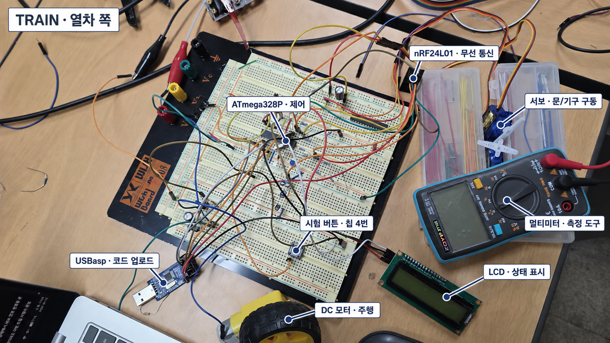
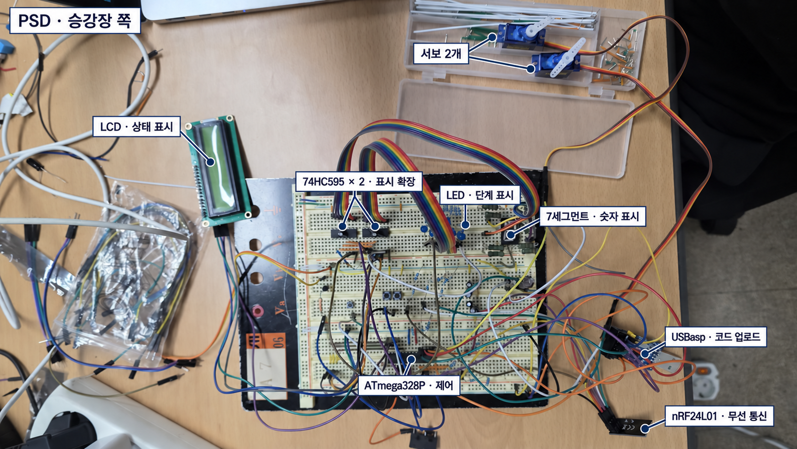

# TRAIN–PSD 작업 인계 요약

열차(TRAIN)와 승강장 스크린도어(PSD)를 무선으로 연동하는 빵판 시제품이다.
**주요 부품의 개별 동작은 확인했다. 다음 작업은 서보 4개의 목표 위치 설정 → 실제 구동을 연결한 모형용 통합 시험이다.** 두 번째 홀센서는 부품을 찾을 때까지 보류한다.

## 1. 회로 사진으로 보기

### TRAIN — 열차 쪽

### PSD — 승강장 쪽

사진 이름표는 부품 위치 안내용이며 배선 검증 결과가 아니다. 가려진 홀센서·작은 소자의 위치와 개별 서보의 핀 대응은 사진에서 단정하지 않았다. TRAIN에도 서보는 2개이며, 사진에는 1개만 뚜렷하게 보인다. 멀티미터와 USBasp는 시험·업로드 도구다.

사진은 내장 이미지 편집으로 이름표를 추가했다. [TRAIN 원본](handoff_images/train_original.png) · [PSD 원본](handoff_images/psd_original.png) · [편집 지시 기록](handoff_images/IMAGE_NOTES.md)

## 2. 지금까지 확인한 것

| 구분 | 현재 상태 |
| --- | --- |
| TRAIN | 주행 모터 1개, 서보 2개, LCD, 홀센서 1개의 기본 동작 확인 |
| PSD | 서보 2개, LCD, LED 9개, 7세그먼트, 부저의 기본 동작 확인 |
| 연동·입력 | 양쪽 무선 기본 연동, 버튼·KW11 입력, 가상 문 상태를 이용한 순서 시험 확인 |
| 홀센서 추가 | 2개 동시 표시 코드는 준비했지만, 추가 센서를 찾지 못해 실물 시험 보류 |

확인은 지금까지의 실물 시험 보고 기준이다. 개별 부품 시험과 전체 자동 운행 성공은 구분한다.

현재 순서 시험은 **자석 1개=출발 준비, 2개=감속, 3개=정차**로 구분한다. 문은 **TRAIN 먼저 열림 → PSD 열림 → 대기·카운트다운 → TRAIN 먼저 닫힘 → PSD 닫힘** 순서다. 문 닫힘 재확인과 오류·복구 로직도 포함되어 있지만, 실제 문 감지는 아직 가상 입력이다.

## 3. 어떤 코드를 쓰는지

모든 파일은 이 `TrainPsd_Breadboard_Toggle` 폴더 안에 있다. 보드에 마지막으로 무엇을 업로드했는지는 LCD 화면으로 확인한다.

| 목적 | 업로드할 파일 | 실제 구동 |
| --- | --- | --- |
| TRAIN 부품 재시험 | [train_actuator_test.ino](train_actuator_test/train_actuator_test.ino) | 서보 2개·모터를 하나씩 수동 시험 |
| PSD 부품 재시험 | [psd_actuator_test.ino](psd_actuator_test/psd_actuator_test.ino) | 서보를 하나씩 수동 시험. LED·세그먼트·부저는 OFF |
| 무선·표시·순서 시험 | 양쪽 [train_sketch.ino](train_sketch/train_sketch.ino) / [psd_sketch.ino](psd_sketch/psd_sketch.ino) | **모터·서보 OFF 유지. 자동 구동 완성본 아님** |
| 홀센서 2개 시험 — 보류 | TRAIN의 [train_hall_test.ino](train_hall_test/train_hall_test.ino) | ADC 값만 표시. 구동 없음 |

재시험은 **각 보드의 칩 4번 버튼: 짧게=항목 선택 / 길게 1초=실행 / 떼면 출력 중단**이다. LCD의 `P15`·`P16`은 선택한 서보 핀이다. 서보는 최대 1초, 모터는 최대 0.7초 출력한다. **이 조작은 단독 시험용이며, 통합 PSD 코드에서는 같은 4번이 비상정지다.** 26번 버튼 추가는 필요 없다.

업로드 설정은 **Arduino Uno / USBasp / 프로그래머를 사용하여 업로드**. TRAIN·PSD 파일을 바꾸어 올리지 말고, `.ino`와 같은 폴더의 나머지 파일도 유지한다. 과거 `psd_wiring_test`는 현재 LED 극성과 달라 재사용하지 않는다.

## 4. 이어서 할 일 — 이 순서대로

1. **서보 4개를 각각 설정한다.** 양쪽 칩 **15번=문 구동, 16번=기계 연결·해제**다. 각 채널의 목표 위치·방향·움직이는 시간을 따로 기록한다. **양쪽 15번은 SG90 호환품이라 같은 명령에도 각도가 다르다.** 지금의 1400/1500/1600µs는 움직임 확인값이지 최종 위치가 아니다. 기구가 없으면 임시 시연값으로 표시한다.
2. **모형용 통합 코드를 준비한다.** 우선 홀센서 1개와 가상 문 입력을 유지한다. 위 위치값을 실제 구동에 연결하되, 현재 출력 차단을 단순히 풀어 사용하는 방식으로 진행하지 않는다. 모터는 더 느리게 갈 예정이지만 현재 속도값은 아직 변경하지 않았다.
3. **바퀴를 띄우고 저속 전체 연동을 시험한다.** 정차·문 순서·표시·부저와 함께 비상정지·통신 끊김 때의 출력 중단, 복구만으로 재출발하지 않는지도 확인한다. 이후 실제 문 센서·기구·선로·최종 전원을 검증한다.

## 5. 유지할 조건

- 핀 번호는 **ATmega328P DIP-28 칩의 실제 다리 번호**다. 현재 홀센서는 TRAIN **23번**, 추가 센서용은 **24번**이다.
- 문 입력은 KW11을 눌러 바꾸는 **가상 V0/V1**이다. V1을 실제 문 닫힘·잠금 확인으로 간주하지 않는다.
- 현재 전원은 **모터 별도 5V / 서보 USB 5V**. 동시 구동 전 전원 용량을 확인한다. GND는 공통으로 하고 USB +5V와 외부 +5V를 직접 묶지 않는다. 배선 변경·업로드 때는 구동기 전원을 끈다.

재시험 방법이 필요할 때만 [서보·모터 상세 안내](ACTUATOR_TEST.md)를 본다. 추가 센서를 찾으면 [홀센서 시험 안내](train_hall_test/README.md)부터 진행한다.
